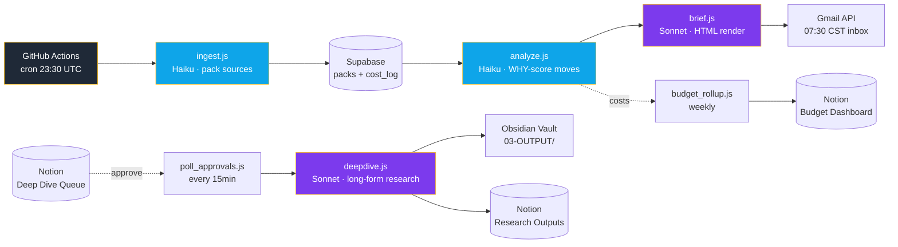

# 🧠 BRAIN Daily Brief

[](https://github.com/gavinhosilvafilipe-byte/brain-daily-brief/actions/workflows/ci.yml)
[](https://opensource.org/licenses/MIT)
[](https://nodejs.org)
[]()
[](https://www.anthropic.com)

> **Autonomous daily research + portfolio briefing system.** Pulls world news, US/Brazil markets, and BRL portfolio moves. Generates a personalized HTML email at **07:30 China time** with WHY-analysis on every position move. Permissioned deep dives flow back into the Obsidian knowledge vault.

Built solo as a portfolio project to prove end-to-end ownership: data ingestion, multi-model AI orchestration, cost engineering, scheduling, third-party APIs, OAuth, and reproducible CI.

---

## 🏗 Architecture



**Why this design**
- **3-tier model routing** keeps cost under $16/month: WASM transforms (<1ms) → Haiku for high-volume packing/scoring → Sonnet only for synthesis & deep dives.
- **Approval gate** for deep dives means no Sonnet spend is wasted on topics I don't care about.
- **Supabase as truth store** for packs + cost_log enables historical replay and budget enforcement.
- **Notion as control plane** so I can queue research without touching code.

---

## ✨ Features

| Feature | Implementation |
|---------|---------------|
| 🌅 Daily HTML brief in inbox | `src/jobs/brief.js` — Sonnet renders mobile-friendly HTML |
| 💼 WHY-analysis on every portfolio move | `src/jobs/analyze.js` — Haiku scores move + drivers |
| 🔍 On-demand deep dives | Approve in Notion → `poll_approvals.js` triggers Sonnet research |
| 📚 Auto-archive to Obsidian | Deep dives land in `03-OUTPUT/` with frontmatter |
| 💰 Budget enforcement | `cost_log` table + weekly rollup, kills runs if monthly cap hit |
| 🗓 Weekly distill | Sunday 18:00 CST — compresses week into 1 themed digest |

---

## 🚀 Setup

### Requirements
- Node ≥20
- Supabase project (free tier OK)
- Notion integration + 4 databases (see schema below)
- Gmail OAuth credentials
- Anthropic API key

### 1. Clone & install
```bash
git clone https://github.com/gavinhosilvafilipe-byte/brain-daily-brief
cd brain-daily-brief
npm install
cp .env.example .env
# Fill in .env with credentials (see Env Vars below)
```

### 2. Supabase schema
```bash
# Open Supabase SQL editor, paste contents of:
cat supabase/migrations/001_initial.sql
```

### 3. Gmail OAuth (one-time)
```bash
npm run gmail-setup
# Visit URL, paste code → copies GMAIL_REFRESH_TOKEN to .env
```

### 4. Notion databases
Create 4 databases, copy each `database_id` to `.env`:
- ⚙️ System Settings · 🔬 Deep Dive Queue · 📄 Research Outputs · 💰 Budget Dashboard

### 5. GitHub Actions secrets
Settings → Secrets → Actions → add every var from `.env.example`.

### 6. Test pipeline
```bash
npm run ingest    # fetch + pack data → Supabase
npm run analyze   # score portfolio moves
npm run brief     # ⚠️ sends real email
```

---

## 🗓 Schedules

| Job | Cron (UTC) | China time | What it does |
|-----|-----------|-----------|--------------|
| Daily pipeline | `30 23 * * *` | 07:30 daily | Full ingest → analyze → brief |
| Weekly distill | `0 10 * * 0` | 18:00 Sunday | Compresses week into themed digest |
| Poll approvals | `*/15 * * * *` | Every 15 min | Checks Notion for approved deep dives |

---

## 💰 Cost model

Targeting **$14–16/month** at ~30 briefs + 2–3 deep dives/week.

| Component | Model | ~Cost/run | Frequency | Monthly |
|-----------|-------|-----------|-----------|---------|
| Ingest pack | Haiku | $0.002 | 30/mo | $0.06 |
| Analyze (WHY) | Haiku | $0.008 | 30/mo | $0.24 |
| Daily brief | Sonnet | $0.12 | 30/mo | **$3.60** |
| Deep dive | Sonnet | $0.10–$0.20 | 10/mo | **$1.50** |
| Weekly distill | Sonnet | $0.15 | 4/mo | $0.60 |
| Supabase/Gmail/GitHub Actions | — | — | — | $0 (free tiers) |
| **Total** | | | | **~$6/mo actual · $16/mo ceiling** |

---

## 📁 Project structure

```
src/jobs/
  ingest.js           # Fetch + pack all sources → Supabase
  analyze.js          # Score portfolio moves (Haiku)
  brief.js            # Generate HTML email (Sonnet) → Gmail
  deepdive.js         # Sonnet deep research on approved topic → Obsidian
  distill_weekly.js   # Weekly pack synthesis
  poll_approvals.js   # Poll Notion for approved deep dives
  budget_rollup.js    # cost_log → Notion Budget Dashboard
scripts/
  gmail-oauth-setup.js  # One-time OAuth setup
.github/workflows/    # Cron triggers + CI
supabase/migrations/  # DB schema
docs/                 # Architecture deep dives
```

---

## 🔐 Env vars

```
ANTHROPIC_API_KEY      # Anthropic console
NOTION_TOKEN           # Notion internal integration
NOTION_SETTINGS_DB_ID
NOTION_DEEPDIVE_DB_ID
NOTION_OUTPUTS_DB_ID
NOTION_BUDGET_DB_ID
SUPABASE_URL
SUPABASE_KEY           # service-role key
GMAIL_CLIENT_ID
GMAIL_CLIENT_SECRET
GMAIL_REFRESH_TOKEN    # from `npm run gmail-setup`
```

---

## 🧪 Testing

```bash
npm test               # unit tests for ingest/analyze formatters
npm run lint           # ESLint
npm run brief -- --dry # generate brief, skip Gmail send
```

---

## 🛣 Roadmap

- [ ] Add Brazilian B3 OHLCV ingestion (XP API or yfinance)
- [ ] Sentiment scoring on news headlines (Haiku batch)
- [ ] Slack mirror of brief (toggle in System Settings)
- [ ] Cost regression tests (kill PR if cost > 1.2× baseline)
- [ ] Streamlit dashboard for cost_log + brief history

---

## 📜 License

MIT — see [LICENSE](LICENSE)

## 👤 Author

**Filipe Gavinho da Silva** — incoming HKUST BBA Quant Finance + CS (Fall 2026), targeting quant/market-making desks ~2030.
[GitHub](https://github.com/gavinhosilvafilipe-byte) · [Email](mailto:gavinho.silva.filipe@gmail.com)
